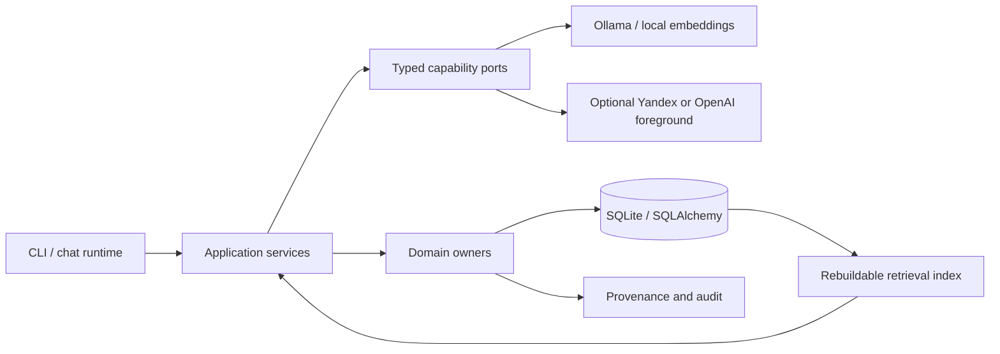

# SATORI

SATORI is a local-first system for a persistent digital character whose identity,
memory, relationships, affect, positions, and personality evolution remain owned by
the application rather than by an LLM provider. Language models are replaceable
capabilities behind typed ports; they never become the source of truth for the
character.

The project explores a practical engineering question: **how can an AI character stay
recognizably consistent across long-running conversations without treating generated
text as authoritative state?**

## Key features

- Persistent identity, personality, values, affect, relationship state, and audit
  history backed by SQLAlchemy and Alembic.
- Source-grounded episodic and semantic memory with embeddings, bounded retrieval,
  provenance, correction, expiry, and rebuildable indexes.
- Separate user/world models and identity-global positions with deterministic owner
  validation instead of direct model writes.
- A typed cognition pipeline that selects needs, context, intent, and response strategy
  without adding a hidden second foreground generation call.
- Bounded reflection and personality evolution with evidence thresholds, cooldowns,
  drift budgets, immutable checkpoints, and append-only restore.
- Provider-neutral foreground conversation with Ollama, Yandex AI Studio, and OpenAI
  Responses adapters. The default remains local Ollama.
- Idempotent requests, transactional state transitions, structured metadata-only logs,
  and fail-closed handling for incomplete provider responses.
- A long-lived CLI runtime for chat, inspection, exports, migrations, and deterministic
  evaluation.

## Architecture

SATORI is a modular monolith with explicit domain ownership and dependency inversion.
Providers may propose text or structured candidates; application managers validate and
commit state under deterministic policies.



Core boundaries:

- `domain` defines aggregates, invariants, typed evidence, and owner policies;
- `application` orchestrates conversation, memory, cognition, affect, reflection, and
  lifecycle transactions;
- `infrastructure` implements persistence and provider adapters;
- `observability` emits bounded metadata without prompt, credential, or raw reasoning
  dumps.

See [`docs/architecture.md`](docs/architecture.md),
[`docs/state-model.md`](docs/state-model.md), and the versioned
[`docs/decisions`](docs/decisions) records for the detailed contracts.

## How a turn works

1. The runtime validates an idempotent interaction request.
2. Deterministic services assemble bounded recent dialogue, retrieved memories, model
   claims, positions, affect, and relationship projections.
3. One selected foreground provider generates a candidate reply from explicitly
   separated trusted policy and untrusted context.
4. A narrow validator rejects unsupported identity, memory, affect, or continuity
   claims and permits at most one bounded retry.
5. The accepted reply and canonical state commit transactionally.
6. Post-response processors may propose memories or other derived state; each domain
   owner independently accepts or rejects the proposal with provenance.

LLM output is never inserted directly into authoritative identity or long-term state.

## Tech stack

- Python 3.12+
- Pydantic and pydantic-settings
- SQLAlchemy 2, SQLite, and Alembic
- Ollama, Yandex AI Studio, and OpenAI Responses adapters
- pytest, Ruff, mypy, uv, and GitHub Actions

## Getting started

Requirements: Python 3.12+, [`uv`](https://docs.astral.sh/uv/), and optionally Ollama
for live local inference.

```bash
git clone https://github.com/Win4ez-ru/Satori.git
cd Satori
uv sync --frozen --all-groups --no-editable
uv run --no-sync alembic upgrade head
uv run --no-sync satori bootstrap
uv run --no-sync satori activate
uv run --no-sync satori status
```

The safe default uses local Ollama. Install the models separately:

```bash
ollama pull qwen3:4b-instruct
ollama pull embeddinggemma:300m
uv run --no-sync satori chat
```

Configuration is environment-based. Copy `.env.example` only when overrides are
needed; it contains no credentials. Cloud providers are opt-in and restricted to the
foreground conversation capability.

## Testing

The deterministic suite covers domain invariants, migrations, repositories, retrieval,
provider contracts, transaction boundaries, CLI behavior, and evaluation fixtures. It
does not require paid provider calls.

```bash
uv run --no-sync ruff format --check .
uv run --no-sync ruff check .
uv run --no-sync mypy src tests
uv run --no-sync pytest
```

Optional integration and paid model evaluations are separate, explicitly authorized
gates. Their evidence and limitations are documented under
[`docs/performance`](docs/performance).

## Project status

SATORI is an advanced experimental prototype, not a hosted consumer product. Stages
0–14 are implemented and acceptance-tested; the current accepted boundary includes
persistent memory, cognition, positions, reflection, inclinations, and bounded
personality evolution.

The provider architecture is production-shaped, but model quality is evaluated
independently from transport correctness. Local Ollama remains the default. Yandex and
OpenAI foreground adapters are available for controlled evaluation; no claim is made
that every provider currently passes the character-quality gate. Stage 15 remains
intentionally locked.

For the complete project contract and current evidence, start with
[`PROJECT_SATORI.md`](PROJECT_SATORI.md), [`docs/index.md`](docs/index.md), and
[`docs/progress.md`](docs/progress.md).

## Repository structure

```text
src/satori/domain/            Aggregates, value objects, and invariants
src/satori/application/       Use cases and domain-owner orchestration
src/satori/infrastructure/    SQLAlchemy repositories and provider adapters
src/satori/observability/     Structured, privacy-bounded telemetry
migrations/                   Alembic schema history
tests/                        Deterministic unit, contract, and lifecycle coverage
docs/                         Architecture, ADRs, evaluation, and performance evidence
```
